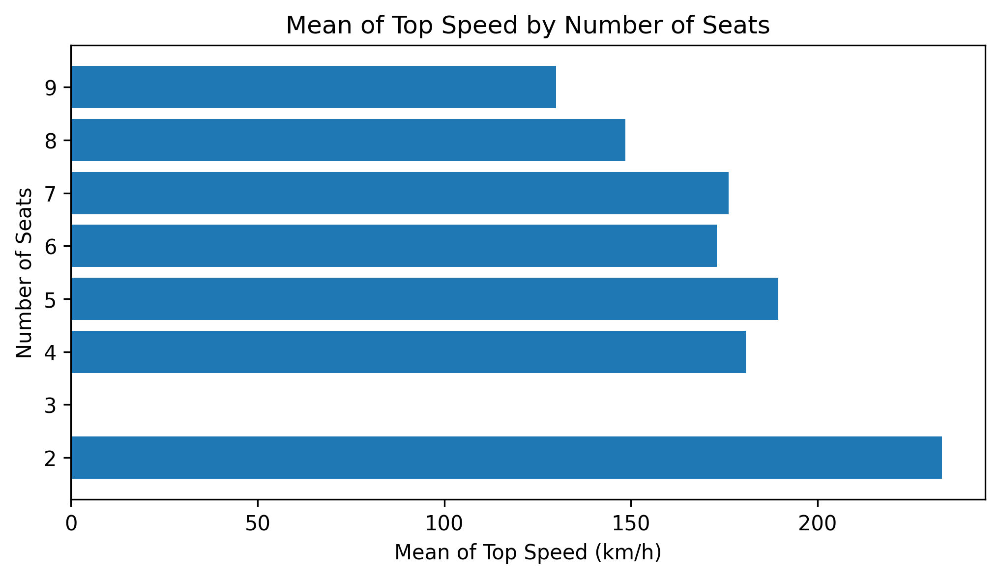
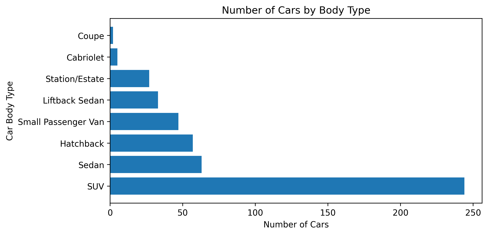
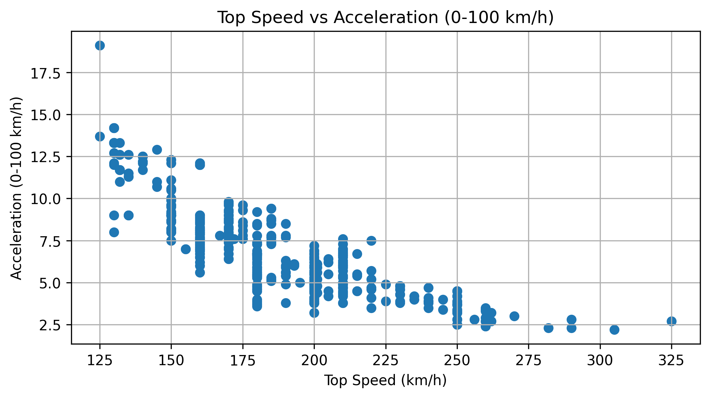

# Python Projects for Data Analytics

This repository contains sample projects for Data Analytics using Python.

## Analysis of Electric Vehicle Specs Dataset (2025)

### Results
#### a. Mean of Top Speed by Number of Seats 
Below is the bar chart shows the top speed Electrical Vehicles by number of seats. As you can see, there's no 3 seats for EV. Then, the fastest cars should be contain only 2 seats. The fact that there are some EV contains more than 7 seats, such as 8 and 9 seats. Why the more seats make the car slower? This is because almost all 2 seats cars is designed for sport or racing, meanwhile if there are 4 or more seats are designed for family cars.

#### b. Number of EV Cars by Body Type
As we can see from the image below, the most EV cars in 2025 are SUV type, following by Sedan and Hatchback. In real life, we can see many of EV are SUV, there are several factors why many of EV are SUV, such as the body quality and space for engine, the trend of car's type, SUV can be family or and sport car, and any else.

#### c. Top Speed vs Acceleration
Below is the scatter plot between Top Speed (X-axis) cars vs Acceleration (Y-axis). This is common sense, beacause the faster of car would have good acceleration. Wen can see the representation, by look the points from left to right, we can imagine there's the line in the middle of that points. That line would be lower as the top speed value is higher. This means acceleration time (from 0 to 100 km/h) inversely propotional to top speed. Simply, if the cars has high speed would have fast acceleration too.

Link of Dataset: https://www.kaggle.com/datasets/urvishahir/electric-vehicle-specifications-dataset-2025
